# 🎯 JaiLyfe — زندگی جنس‌محور

> پلتفرم هوشمند خرید و فروش با فناوری سه‌بعدی، اقتصاد مشارکتی و سیستم واسطه‌گری بدون هزینه برای فروشنده

---

## 🌐 دموی زنده

**مشاهده پلتفرم در حال اجرا:** [https://jailyfe.com](https://jailyfe.com)

---

## 📸 تصاویر پلتفرم

### 🏠 صفحه اصلی

#### نمای کامل صفحه اصلی

  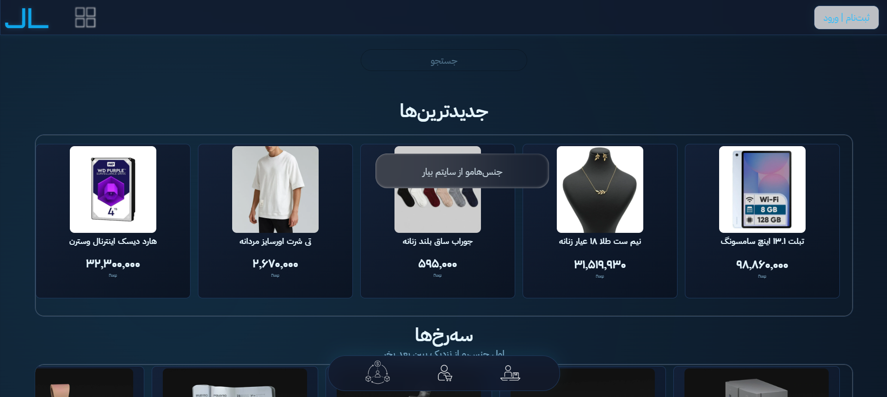

#### بخش‌های مختلف صفحه اصلی

  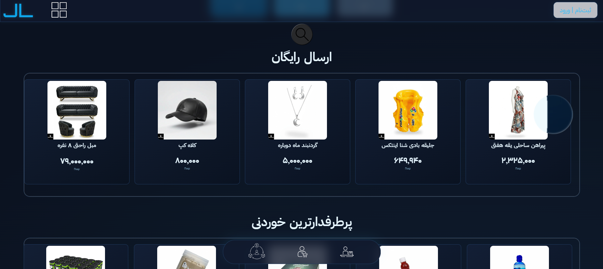
  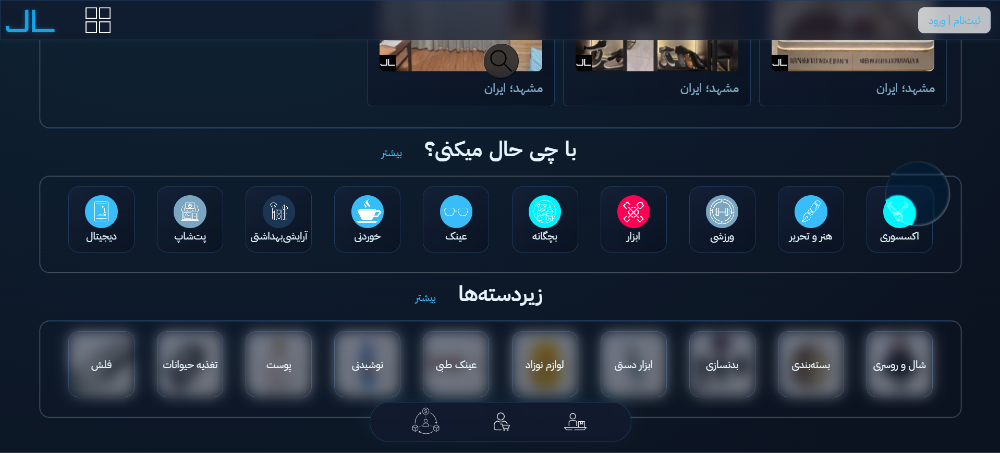

---

### 🔍 جستجو و فیلتر

#### صفحه جستجو

  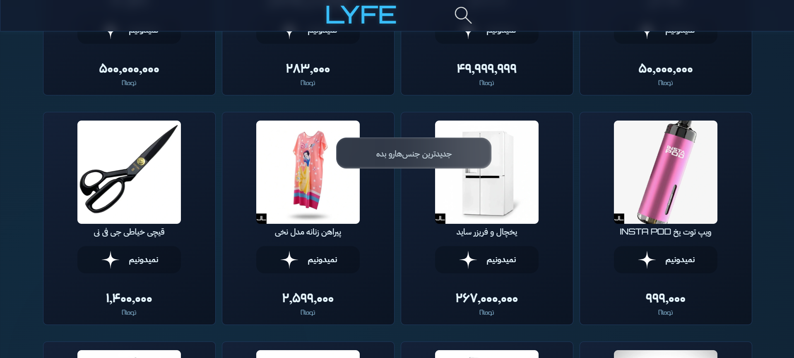

#### فیلترهای پیشرفته

  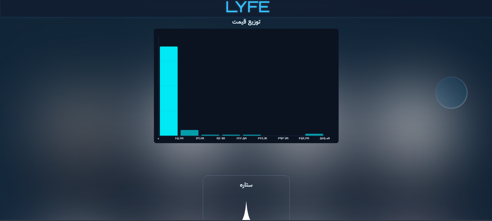

---

### 🛍️ مشاهده محصول

#### نمای کامل محصول

  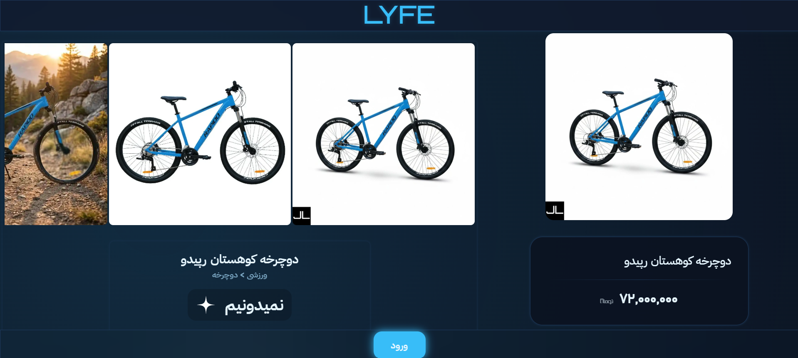

#### جزئیات محصول

  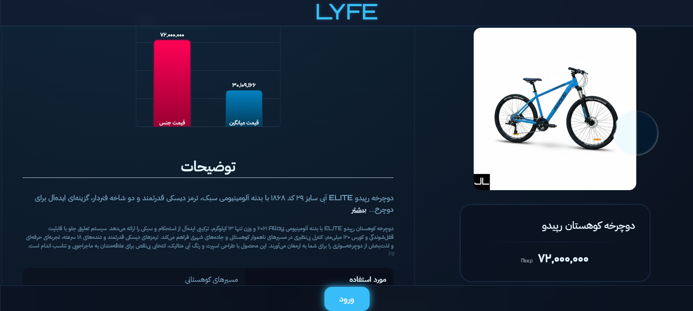
  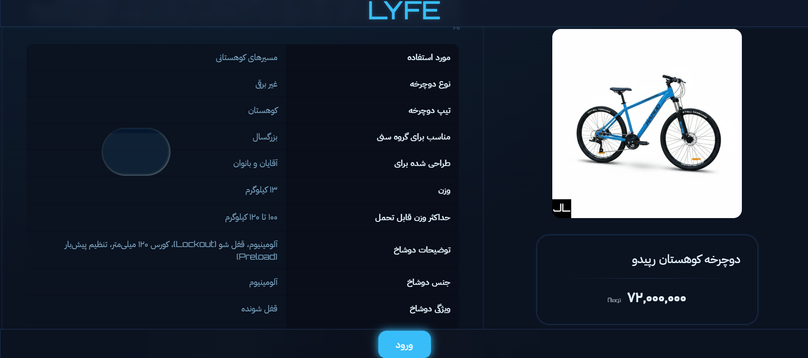

#### اطلاعات تکمیلی

  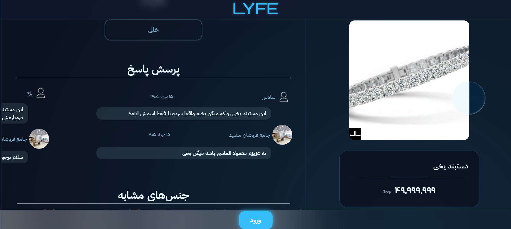

---

### 🎮 تجربه سه‌بعدی

#### مشاهده محصول در فضای سه‌بعدی

  

#### قدم زدن در فروشگاه مجازی

  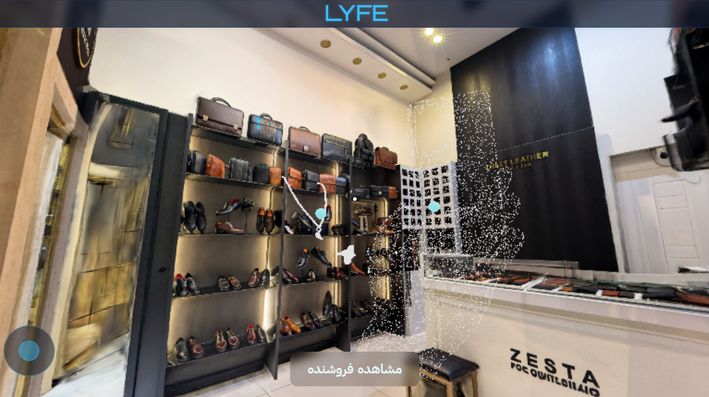
  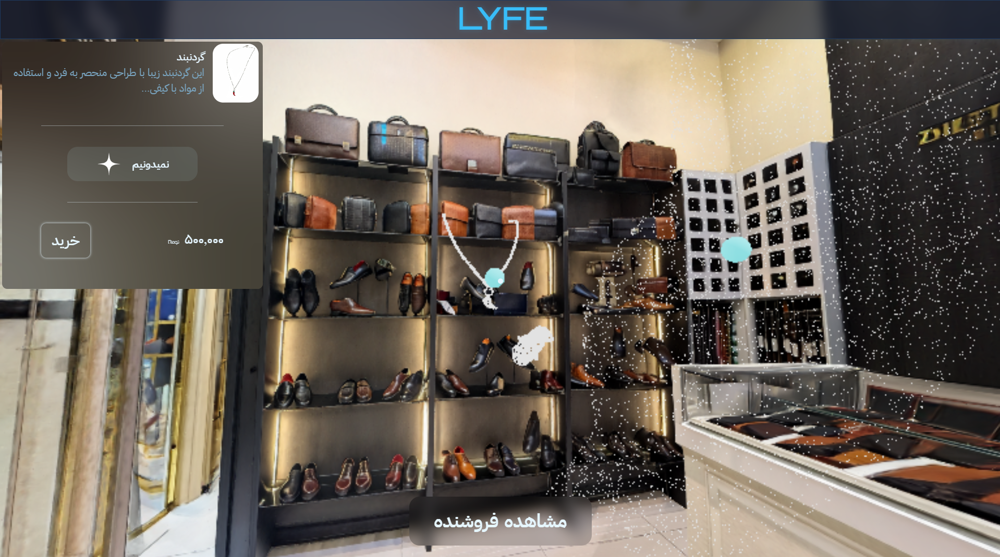

---

### 🤖 دستیار هوشمند

#### دستیار مجهز به هوش مصنوعی

  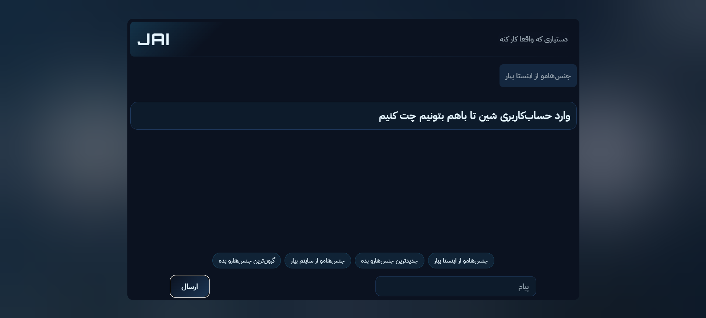

---

## ✨ ویژگی‌های کلیدی

### 🏪 فروشنده (Seller)
- **سایت‌ساز بدون کدنویسی** — ساخت فروشگاه اختصاصی با چند کلیک
- **تبدیل فروشگاه فیزیکی به فضای سه‌بعدی** — با فقط ۴ عکس
- **سه‌بعدی‌سازی محصولات** — از یک عکس به مدل سه‌بعدی قابل تعامل
- **شبکه واسطه‌گری رایگان** — هزینه دلال‌ها با پلتفرم است، نه فروشنده
- **کاهش بازگشت کالا** — خریدار محصول را از همه زوایا می‌بیند

### 🛒 خریدار (Buyer)
- **قدم زدن در فروشگاه‌های مجازی** — تجربه خرید فیزیکی آنلاین
- **بررسی دقیق محصولات** — چرخاندن و بزرگنمایی محصول در فضای سه‌بعدی
- **دریافت «سهام»** — به ازای هر خرید، سهامدار پلتفرم می‌شوید
- **سود از پلتفرم** — هر ۲ هفته، ۵ سهامدار برتر از سود جیلایف بهره‌مند می‌شوند

### 🤝 دلال (Dallal)
- **لینک اختصاصی** — برای هر محصول لینک معرفی دریافت کنید
- **درآمد بدون سرمایه** — از فروش‌هایی که از طریق لینک شما انجام می‌شود سود ببرید
- **بدون هزینه برای فروشنده** — هزینه دلالی با پلتفرم است

---

## 🤖 هوش مصنوعی و قابلیت‌های پیشرفته

دستیار هوش مصنوعی جیلایف، فروشندگان را در مدیریت فروشگاه خود توانمند می‌سازد:

### 💰 مدیریت هوشمند قیمت‌ها
- **تغییر قیمت دسته‌جمعی:** به دستیار بگویید "۱۰٪ تخفیف روی همه تیشرت‌ها بگذار" و هوش مصنوعی بلافاصله قیمت‌ها را به‌روزرسانی می‌کند
- **تخفیف‌های هوشمند:** اعمال تخفیف بر اساس دسته‌بندی، برند یا بازه قیمتی با یک فرمان ساده
- **مدیریت قیمت‌گذاری پویا:** تنظیم قیمت‌ها بر اساس رقبا، تقاضا و روندهای بازار

### 📥 واردات خودکار محصولات
- **از طریق اینستاگرام:** با وارد کردن یک نام کاربری اینستاگرام، تمام پست‌ها و محصولات به‌صورت خودکار وارد فروشگاه می‌شوند
- **از طریق پست اینستاگرام:** یک لینک پست اینستاگرام را وارد کنید تا محصول به‌صورت خودکار در فروشگاه شما ثبت شود
- **از طریق وب‌سایت:** با وارد کردن لینک یک وب‌سایت، اطلاعات محصول به‌صورت خودکار استخراج و در فروشگاه شما قرار می‌گیرد
- **شناسایی خودکار:** هوش مصنوعی قیمت، توضیحات، تصاویر و دسته‌بندی محصول را به‌طور خودکار تشخیص می‌دهد

### 📊 مدیریت فروش و گزارشات
- **مشاهده سفارشات:** نمایش کامل و لحظه‌ای تمام سفارشات دریافتی
- **گزارشات دقیق پرداخت:** گزارشات شفاف از تراکنش‌ها، کارمزدها و سود فروشنده
- **تحلیل فروش:** شناسایی محصولات پرفروش، زمان‌های اوج خرید و رفتار مشتریان
- **داشبورد مدیریتی:** نمایش لحظه‌ای عملکرد فروشگاه و درآمد

### ✨ سایر قابلیت‌های هوش مصنوعی
- **تبدیل عکس به سه‌بعدی:** فقط با ۴ عکس، فضای فروشگاه یا محصول به مدل سه‌بعدی تبدیل می‌شود
- **دستیار هوشمند خرید:** راهنمایی و مشاوره به خریداران
- **پیشنهادات شخصی‌سازی‌شده:** بر اساس سلیقه و تاریخچه خرید کاربر
- **بهینه‌سازی سئو:** تولید خودکار توضیحات و کلمات کلیدی برای محصولات

---

## 🎯 مزیت رقابتی

| ویژگی | جیلایف | دیجی‌کالا | خانومی | باسلام |
|--------|---------|-----------|---------|---------|
| **فضای سه‌بعدی فروشگاه** | ✅ | ❌ | ❌ | ❌ |
| **مشاهده محصول از همه زوایا** | ✅ | ❌ | ❌ | ❌ |
| **تبدیل عکس به سه‌بعدی** | ✅ | ❌ | ❌ | ❌ |
| **اقتصاد مشارکتی (سهام)** | ✅ | ❌ | ❌ | ❌ |
| **سه نقش در یک حساب** | ✅ | ❌ | ❌ | ❌ |
| **واسطه‌گری رایگان برای فروشنده** | ✅ | ❌ | ❌ | ❌ |
| **سایت‌ساز بدون کدنویسی** | ✅ | ✅ | ❌ | ❌ |
| **کاهش بازگشت کالا** | ✅ | ❌ | ❌ | ❌ |
| **واردات خودکار از اینستاگرام** | ✅ | ❌ | ❌ | ❌ |
| **تغییر قیمت دسته‌جمعی با هوش مصنوعی** | ✅ | ❌ | ❌ | ❌ |
| **گزارشات دقیق پرداخت** | ✅ | ✅ | ❌ | ❌ |

---

## 🛠️ تکنولوژی‌ها

| بخش | تکنولوژی |
|-----|----------|
| **بک‌اند** | Python, Django, Django REST Framework |
| **فرانت‌اند** | HTML, CSS, JavaScript, React |
| **هوش مصنوعی** | TensorFlow, PyTorch, OpenCV, NLP Models |
| **سه‌بعدی** | Three.js, WebGL, 3D Reconstruction Models |
| **پایگاه داده** | PostgreSQL |
| **دپی‌لوی** | Nginx, Gunicorn, Docker |

---

## 📊 آمار کلیدی

| شاخص | مقدار |
|------|-------|
| **بازار هدف** | ۸۰ میلیون+ کاربر |
| **درآمد به ازای هر فروشنده** | ۱۲ میلیون+ تومان |
| **نقش در یک حساب کاربری** | ۳ نقش همزمان |
| **سرمایه موردنیاز برای ورود کاربر** | ۰ تومان |

---

## 🚀 چشم‌انداز

جیلایف در حال تغییر نحوه خرید، فروش و کسب درآمد در ایران است. با ترکیب **هوش مصنوعی**، **فناوری سه‌بعدی** و **اقتصاد مشارکتی**، پلتفرمی ساخته‌ایم که نه تنها نیازهای فعلی بازار را پاسخ می‌دهد، بلکه آینده تجارت الکترونیک ایران را شکل می‌دهد.

---

> **جیلایف** — زندگی جنس‌محور 🚀
